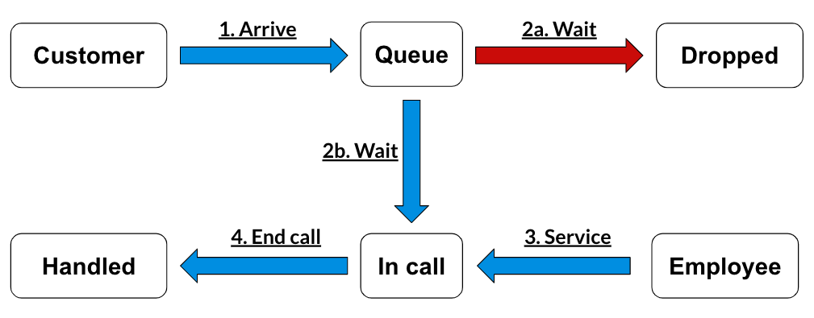

# Call Center Simulation


Photo by [Pixabay](https://www.pexels.com/photo/gray-wooden-computer-cubicles-inside-room-267507/)

## Requirements

- Python 3.10
- venv

## Setup steps

```
python -m venv venv

source venv/bin/activate

pip install -r requirements.txt
```

## Run Simulation

```
python call_center_simulation.py
```

## Table of Contents
1. [Abstract](#abstract)

2. [Data preparation](#data-preparation)

3. [Problem Definition](#problem-definition)

4. [Programming Overview](#programming-overview)

5. [Conclusion and future works](#conclusion-and-future-works)

- [Built with](#built-with)
- [Author](#author)

---

## Abstract

Process simulations have a variety of applications ranging across science, mathematics, and business. Businesses in particular establish protocol in servicing consumers and thus have predictable and reproducible behaviors that may be replicated via simulation. This project explores the scenario of a call center whose key performance metric is the percentage of calls dropped by customers due to late service times. I examined the minimum number of employees a call center must hire to lower this key performance metric to.

---

## Data preparation

The simulation requires the following inputs:

| Variable | Definition |
| ----------------------------- | -----------------------------: |
| Number of employees | employees available to handle customer calls |
| Average support time | average time taken to resolve a customer issue |
| Average support time standard deviation | variability in support time |
| Customers per minute | average customers per minute following a Poisson distribution |
| SLA time threshold  | ideal wait time threshold to pick up the phone |
| Customer dropout time threshold | wait time a customer is willing to tolerate before dropping out |
| Customer dropout time standard deviation | variability in customer dropout time |


---

## Problem Definition

Executives have approached their analyst team with the following issue: there is insufficient staff to handle the current volume of customers, leading to customers dropping off calls at high rates. They ideally want only 5% of calls to be dropped by the customer. They have tasked the analyst team with drafting a recommendation for hiring the minimum number of call center employees to achieve the 5% drop goal.

In drafting this recommendation, the analyst team decides to create a process simulation that mimics caller behavior. This simulation has 2 stages:

- **Stage 1:** The caller calls the company that is directed toward the call center and enters the queue. At the time of arrival, if there are no customers in the queue and an employee is available, they immediately exit this stage and enter Stage 2. If no employees are available to service them, they wait at the front of the queue and will be the first to be extracted from the queue the moment an employee becomes available. If there are customers in the queue, they enter the back of the queue.
- **Stage 2:** The caller may exit the queue in one of three ways: either by receiving service, by leaving the queue on their own, or if the workday ends.

The overall flow for the call center can be illustrated in Fig 1.

**Fig 1.** Call Center Flow


Like in real life, the callers in this problem do not arrive at perfectly consistent nor predictable intervals. Customers entering the queue are modeled via a poisson distribution where the mean number of callers arrive per minute. I tested three different mean calls per minute in this simulation: 0.5 caller per minute, 1 caller per minute, and 2 callers per minute. Likewise, not all callers drop out of the waiting queue at the same time; the time that they drop follows a normal distribution with a mean of 15 minutes and a standard deviation of 5 minutes. Additionally, the time for an employee to support a caller follows a normal distribution with a mean of 10 minutes and a standard deviation of 3 minutes. Employees may only service one caller at a time. After finishing servicing one customer, they remove a caller from the front of the queue and service them.

---

## Programming Overview
The code implements the call center simulation and evaluates KPIs to analyze the call center's performance. The simulation is ran with different parameters, including the number of employees and the mean number of customers per minute. There are 30 different parameters since there are 3 different mean number of customers with 10 different numbers of employees. For each parameter, the simulation is ran for 8 hours 30 times. It tracks metrics such as the total number of customers, handled and dropped calls, average queue and call times, and drop ratio. The simulation results are saved in log files, and summary statistics are calculated and stored in CSV files. This approach enables a comprehensive assessment of the call center's efficiency and provides insights for optimizing its operations.

---

## Conclusion and future works

We tested three different mean number of customers per minute: 0.5 customer, 1 customer, and 2 customers. Below is a table with those mean number of customers corresponding with the recommended number of call center employees to hire in order to ensure the caller drop rate is below 5%:

| Mean Number of Customers Per Minute | Recommended Employees to Hire  |
| ----------------------------- | -----------------------------: |
| 0.5 customer                   | 6                             |
| 1 customer                      | 12                             |
| 2 customers                     | 18                              |

The call center simulation project lays the foundation for further research and enhancements. Some potential areas for future work include:

- **Adding Simulation Resource:** Currently, there is only one simulation variable, the empolyee. By adding other resource, such as technical support staff, can create a simulation closely resembling  real life.
- **Optimization:** Apply optimization techniques to determine the optimal number of employees, support time, and other parameters to maximize call center performance.
- **Machine learning integration:** Explore the integration of machine learning algorithms to predict call volumes, customer behavior, and optimize call center resource allocation.
- **Sensitivity analysis:** Conduct sensitivity analysis to assess the impact of changing parameters on KPIs and identify the most influential factors.

By addressing these future works, the project can further enhance the accuracy and practicality of the call center simulation model.

---

## Built With

* **Software Packages:**  [Python](https://www.python.org/), [Simpy](https://simpy.readthedocs.io/en/latest/), [Numpy](https://numpy.org/), [Pandas](https://pandas.pydata.org/docs/)
* Inspired by [NeuralNine](https://youtu.be/8SLk_uRRcgc)
## Author

* **Takeshi Sugiyama** - *Data Scientist*
  * [Linkedin](https://www.linkedin.com/in/takeshi-sugiyama/)
  * [Tableau](https://public.tableau.com/profile/takeshi.sugiyama)
